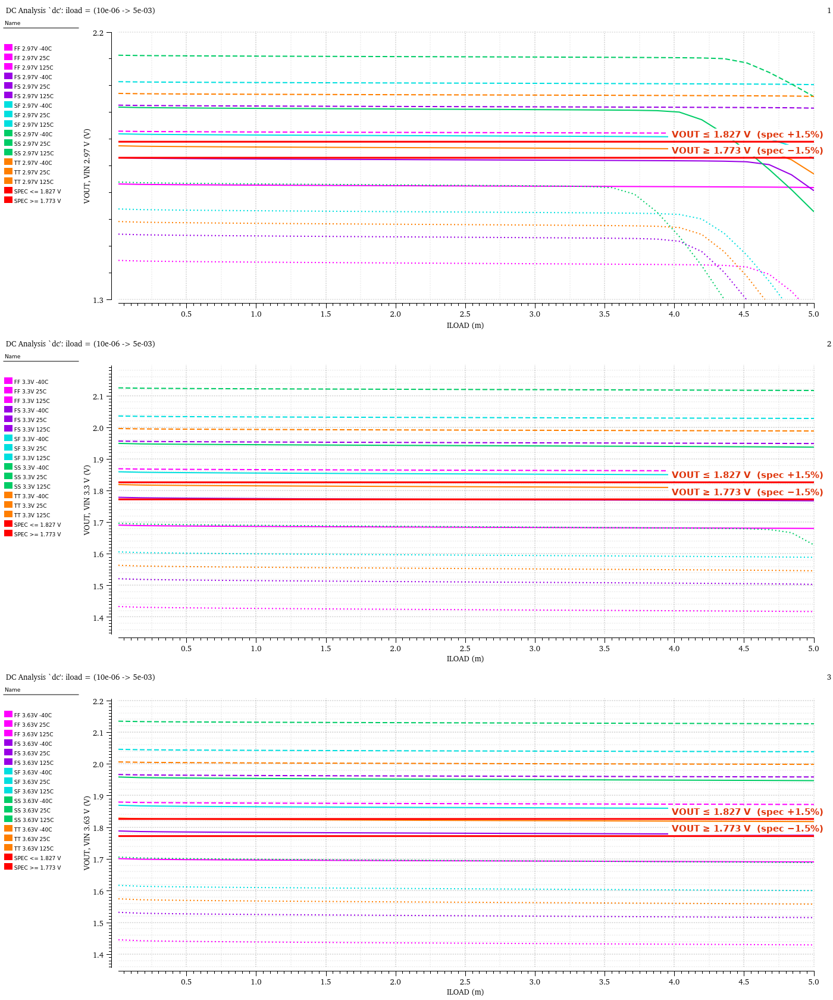

# QbtLdo1p2 — LDO LDR results

Low-level design review of `myLib/QbtLdo1p2` against the 15-check LDO LDR page
(https://borenw.github.io/ldo-loadreg-setup/), with real Spectre / ADE XL results.
Simulated in a 0.18 µm process with the foundry PDK models; PDK names, model files and paths are
kept out of this repo (put yours in `ldr_page/ldr_config.local.json`, which is not committed).

## [▶ Open the rendered report](https://borenw.github.io/qbtldo1p2-ldr/)

Same layout as the public LDR page: every figure tagged *Cadence result* is a real Spectre run exported
from Virtuoso Visualization; anything stamped PLACEHOLDER is still the page's illustrative model (#15 only).

**Jump to a check:** [#1 Stability](https://borenw.github.io/qbtldo1p2-ldr/ldr_page/out/ldr_tb_QbtLdo1p2_LoadReg_Interactive.1.html#c1) · [#2 Dropout](https://borenw.github.io/qbtldo1p2-ldr/ldr_page/out/ldr_tb_QbtLdo1p2_LoadReg_Interactive.1.html#c2) · [#3 Current limit](https://borenw.github.io/qbtldo1p2-ldr/ldr_page/out/ldr_tb_QbtLdo1p2_LoadReg_Interactive.1.html#c3) · [#4 Load transient](https://borenw.github.io/qbtldo1p2-ldr/ldr_page/out/ldr_tb_QbtLdo1p2_LoadReg_Interactive.1.html#c4) · [#5 PSRR](https://borenw.github.io/qbtldo1p2-ldr/ldr_page/out/ldr_tb_QbtLdo1p2_LoadReg_Interactive.1.html#c5) · [#6 Line transient](https://borenw.github.io/qbtldo1p2-ldr/ldr_page/out/ldr_tb_QbtLdo1p2_LoadReg_Interactive.1.html#c6) · [#7 Startup](https://borenw.github.io/qbtldo1p2-ldr/ldr_page/out/ldr_tb_QbtLdo1p2_LoadReg_Interactive.1.html#c7) · [#8 Accuracy and regulation](https://borenw.github.io/qbtldo1p2-ldr/ldr_page/out/ldr_tb_QbtLdo1p2_LoadReg_Interactive.1.html#c8) · [#9 VREF](https://borenw.github.io/qbtldo1p2-ldr/ldr_page/out/ldr_tb_QbtLdo1p2_LoadReg_Interactive.1.html#c9) · [#10 Offset Monte Carlo](https://borenw.github.io/qbtldo1p2-ldr/ldr_page/out/ldr_tb_QbtLdo1p2_LoadReg_Interactive.1.html#c10) · [#11 Quiescent current](https://borenw.github.io/qbtldo1p2-ldr/ldr_page/out/ldr_tb_QbtLdo1p2_LoadReg_Interactive.1.html#c11) · [#12 Reverse current](https://borenw.github.io/qbtldo1p2-ldr/ldr_page/out/ldr_tb_QbtLdo1p2_LoadReg_Interactive.1.html#c12) · [#13 Thermal shutdown](https://borenw.github.io/qbtldo1p2-ldr/ldr_page/out/ldr_tb_QbtLdo1p2_LoadReg_Interactive.1.html#c13) · [#14 Noise](https://borenw.github.io/qbtldo1p2-ldr/ldr_page/out/ldr_tb_QbtLdo1p2_LoadReg_Interactive.1.html#c14) · [#15 EM / IR and aging](https://borenw.github.io/qbtldo1p2-ldr/ldr_page/out/ldr_tb_QbtLdo1p2_LoadReg_Interactive.1.html#c15) · [Load regulation, worked example](https://borenw.github.io/qbtldo1p2-ldr/ldr_page/out/ldr_tb_QbtLdo1p2_LoadReg_Interactive.1.html#lr)

[](https://borenw.github.io/qbtldo1p2-ldr/ldr_page/out/ldr_tb_QbtLdo1p2_LoadReg_Interactive.1.html#lr)

Source of the page: `ldr_page/out/ldr_tb_QbtLdo1p2_LoadReg_Interactive.1.html`, figures in `ldr_page/out/figs/`
(GitHub shows the HTML as source; use the link above to see it rendered). `ldr_page.py --embed` makes a
single self-contained file instead.

## Regenerate

```sh
# Cadence environment loaded (spectre + virtuoso on PATH)
ldr_page/run_ldr.sh  ~/myLib/tb_QbtLdo1p2_LoadReg/adexl/results/data/Interactive.1.rdb
```

| Step | Tool | What it does |
|---|---|---|
| 1 | `ldr_run.py` | builds one Spectre deck per check × corner around the DUT subckts taken from the ADE netlist, runs Spectre in parallel, evaluates metrics with the ADE calculator in `virtuoso -nograph`, exports the figures from Virtuoso Visualization (red spec lines, labelled with value and criterion), writes `results/real.json` |
| 2 | `ldr_page.py` | starts from the published page, swaps in the ADE XL load-regulation run (rdb) and everything in `real.json`, stamps PLACEHOLDER on the rest |

Corners, loads and spec limits live in `ldr_page/ldr_config.json`; PDK section names (per-corner
model sections, mismatch sections, the mismatch-model suffix) go in `ldr_page/ldr_config.local.json`. The specs are the public page's
limits scaled from its 1.2 V / 300 mA example to this LDO; edit them to the real targets and rerun.
`ldr_run.py --checks 4,5 --no-sim` re-exports figures from existing runs in seconds.

## Findings (TT/SS/FF/SF/FS × VIN 2.97/3.3/3.63 V × −40/25/125 °C)

| # | Result |
|---|---|
| 1 Stability | PM ≥ 60° and GM ≥ 12.8 dB wherever the loop has gain; at SS 2.97 V and 5 mA the LDO is in dropout and loop gain collapses |
| 2 Dropout | VDO up to 1.56 V at 5 mA (SS 125 °C) |
| 3 Current limit | no limiter: peak IOUT 4.7 to 12.1 mA across corners |
| 4 / 6 Transients | with 100 pF on VOUT a 10 µA→5 mA step in 1 µs moves VOUT by ~2.5 V; a 1 V/µs VIN step pushes SS 125 °C into dropout |
| 5 PSRR | ≤ 32 dB at 1 kHz (mask 60 dB) |
| 7 Start-up | **fails at TT 3.3 V, −33 and −32 °C**: the reference latches with VREF at VIN and VOUT stays at 0.58 V |
| 9 VREF | the on-chip reference moves about −1.3 mV/°C (−1,465 ppm/°C): up to 20.6 % error over −40 to 125 °C, which sets most of the VOUT error |
| 10 Offset MC | the EA input pair M1/M2 uses devices with no mismatch model, so Monte Carlo cannot see the EA offset; the 2.5 mV is systematic offset |
| 11 IQ | 3.7 µA max at no load |
| 12 Reverse current | 0.66 A into VOUT at 1.8 V with VIN = 0: the pass-device body diode conducts, no blocking |
| 13 Thermal shutdown | none up to 165 °C (models fail above ~166 °C) |
| 14 Noise | up to 808 µVrms, 10 Hz to 100 kHz |
| 15 EM/IR, aging | not runnable: no aging model cards (SPECTRE-17074), no post-layout extraction |

## Other files

| Path | What |
|---|---|
| `report/` | `ldo_report.py`: interactive HTML report of one ADE XL run (rdb + PSF) |
| `build_tb_QbtLdo1p2_LoadReg.il` | SKILL that builds `myLib/tb_QbtLdo1p2_LoadReg/schematic` |
| `ldo_loadreg_QbtLdo1p2.il`, `ldo_pvt_corners_QbtLdo1p2.il` | the public scripts configured for this bench |
